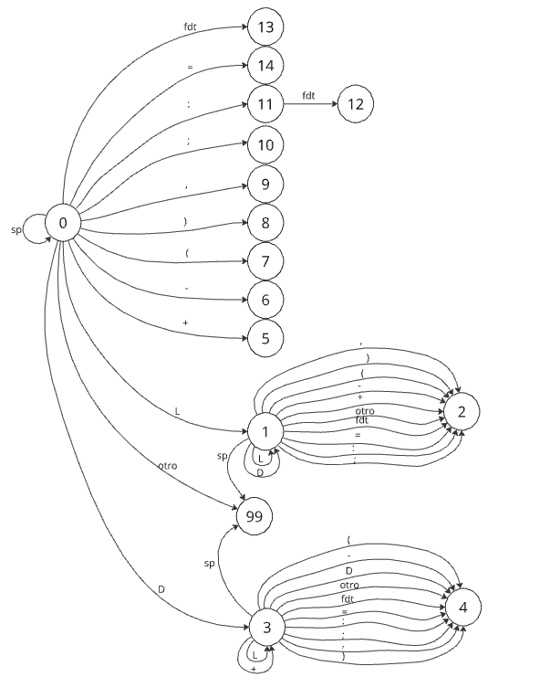

# SSL Micro Scanner

Scanner para el lenguaje Micro como está definido en el libro del profesor Muchnik de Sintaxis y Semántica de los Lenguajes

## Integrantes del grupo
-Kevin Cadenas 
-Ignacio Jubilla
-Lucio

## Instrucciones para compilar
 mingw32-make 
## Instrucciones para probar
 - cd a la carpeta scanner, donde esta el Makefile  
 - mingw32-make test
## Diagrama de transición

## Qué cambios hicimos y por qué

- Lo primero que hicimos fue redefinir el Token en el scanner.h con enum para que cada Token tenga un número asignado.

- Completamos la función:
  ```C++
    void LimpiarBuffer (voi);
  ```
  para que el residuo de una cadena no pise a otra cadena
  
  EsReservada (para discriminar el caso en el que la cadena es una palabra reservada)
  Y la tabla de transiciones que define al AFD. Modificamos el archivo Makefile para que pueda correr en windows
  ya que la mayoria contamos con ese sistema operativo. En la funcion scanner agregamos que c = getchar() != EOF dentro 
  del while para que no itere infinitamente. Añadimos cmd /c "mmc < test.ok.micro" al Makefile en test: clean mmc para 
  que corra el tes.ok.micro.

  Para reconocer los errores lexicos, si la columna pertenece a la de un elemento no reconocido la funcion Transicion devolvera -1.
  y dentro de la funcion scanner si el valor que se le asigna a estad